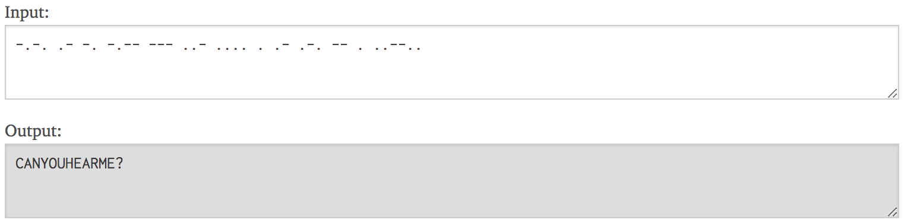

## Samuel's Code

**Category:** Cryptography

**Points:** 100

**Description:** I'm so disoriented right now.

**Hint:** None.

## Write Up

We are given an audio file. Upon listening, you can notice it consists of short and long tone notes. If this sounds familiar then it's because the audio file is playing morse code. Writing down the frequencies of the notes and utilizing an free online tool to convert it will result in the decoding of the flag.

The flag is: AHCTF{canyouhearme?}
