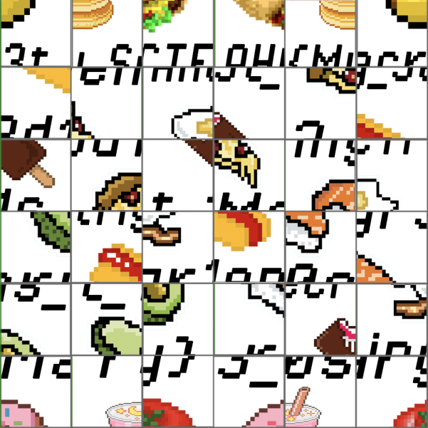
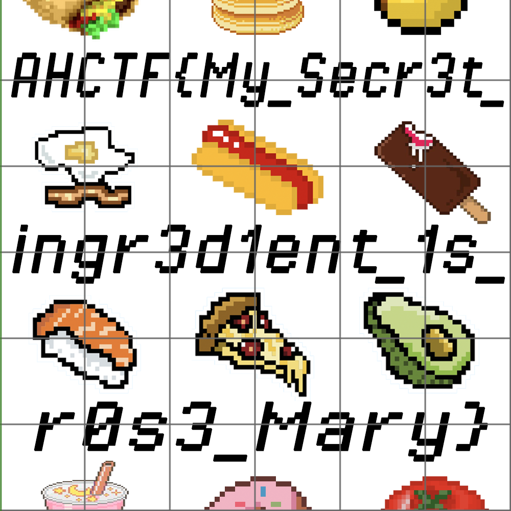

## Secret Ingredient

**Category:** Forensics

**Points:** 50

**Description:** My uncle never told me his secret ingredient to his famous ratatouille recipe. This weird image is the only clue. What does it mean?

**Hint:** None.

## Write Up

We are given this image from the description:

From this image, you can tell that it has been digitally manipulated into a mix square grid. To get the flag you must fix this by manipulating the image back by switching around the squares, doing so will result it to the original.

The flag is: AHCTF{My_Secr3t_ingr3d1ent_1s_r0s3_Mary}
