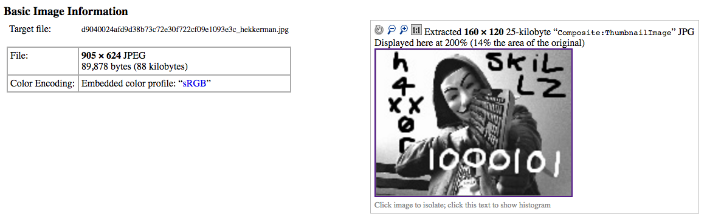

**Category:** Forensics

**Points:** 85

**Description:** Hekkerman is looking awfully spooky. That hekker glare could pierce a firewall. What can he see that you can't?

## Write Up

We are given this image from the description:

We used a tool called "binwalk" that analyzes file contents. Binwalk can be found here: https://github.com/devttys0/binwalk

After running binwalk on the image, we found 3 instances of JPEG image data in the file itself.

From the discoveries, the next plan was to view the image more in-depth using free online photo forensic sites. The one we used was: http://exif.regex.info/exif.cgi

Putting in the original Hekkerman image file revealed a thumbnail that was quite different from the original image.

